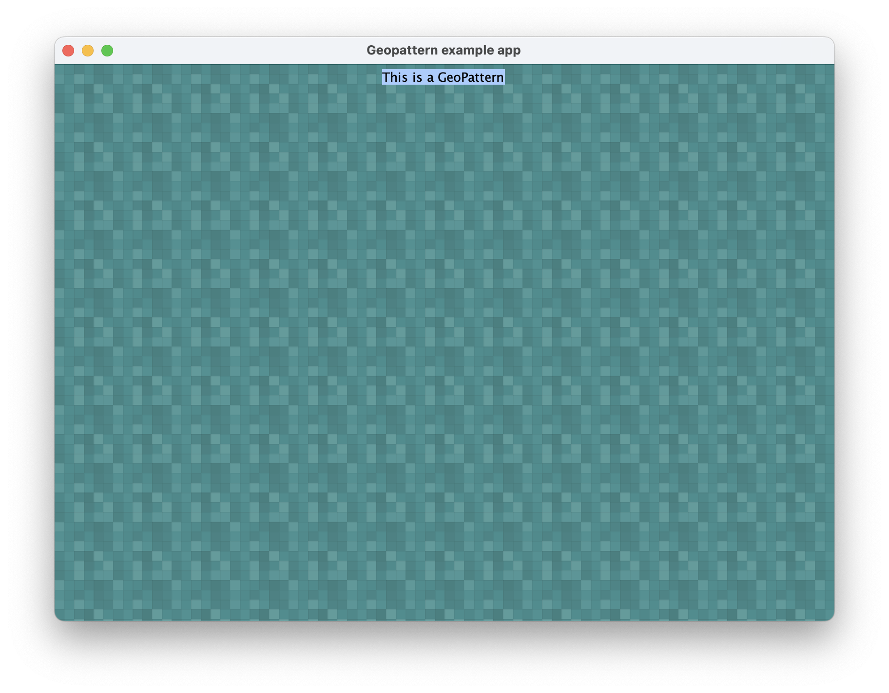

# GeoPattern Swing

## About 
This project is a demonstration of the [GeoPattern Java library](https://github.com/jselzer/geopattern) using the Swing toolkit.

### Prerequisites

- JDK 11 or greater
- Intellij IDEA recommended
